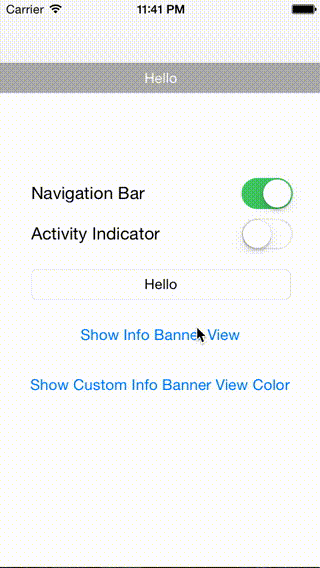

# RADInfoBannerView

[](http://cocoapods.org/pods/RADInfoBannerView)
[](http://cocoapods.org/pods/RADInfoBannerView)
[](http://cocoapods.org/pods/RADInfoBannerView)



## Usage

To run the example project, clone the repo, and run `pod install` from the Example directory first.

## Requirements

+ Swift 2.0
+ iOS 8.0+

## Installation

RADInfoBannerView is available through [CocoaPods](http://cocoapods.org). To install
it, simply add the following line to your Podfile:

```ruby
pod "RADInfoBannerView"
```

## Usage

Import module
```swift
import RADInfoBannerView
```

Showing simple info banner view with "Hello" text

```swift
RADInfoBannerView.showInfoBannerView("Hello")
```

With Activity Indicator and hide delay

```swift
RADInfoBannerView.showInfoBannerView("Loading more messages", showActivityIndicatorView: true, hideAfter: 5.0)
```

Customize info banner view

```swift
let infoBannerView = RADInfoBannerView(text: text, showActivityIndicatorView: self.activityIndicatorSwitch.on)
infoBannerView.backgroundColor = .redColor()
infoBannerView.textLabel.textColor = .yellowColor()
infoBannerView.show().hide(afterDelay: 3.0)
```

**NOTE:** If you're using **UIViewController Containment** you will need to specify which controller you want to show the info banner view
```swift
RADInfoBannerView.showInfoBannerView("Loading more messages", showActivityIndicatorView: true, inController: self)
```

Lastly, Hiding
```swift
RADInfoBannerView.hideAllInfoBannerView(inController: self, animated: true)
```

## Communication

- If you **found a bug**, open an issue.
- If you **have a feature request**, open an issue.
- If you **want to contribute**, submit a pull request.

## License

RADInfoBannerView is available under the MIT license. See the LICENSE file for more info.
